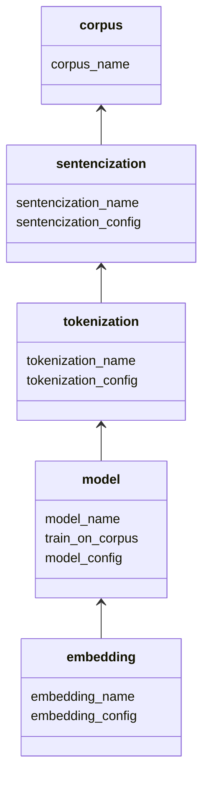
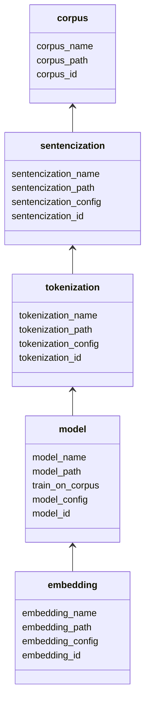

# Generate embeddings

This describes how to generate embeddings using `generate_embeddings.py` and a `json` file specifying how the embeddings should be generated

## Example configuration 
File `embeddings_config.json`

```json
[
{
"corpus_name": "1800s_english",
"corpus_path": "preprocessing/generate_embeddings/corpora/english-1800.txt",
"tokenizations": 
	[
		{
			"tokenization_name": "default_tokenization", 
			"tokenization_config":
			{
				"workers":64,
				"min_length":0
			},
			"models":
			[
				{
					"model_name": "default_model", 
					"model_type": "Word2Vec",
					"train_on_corpus": true,
					"model_config": 
						{
							"vector_size": 100, 
							"window":5,
							"min_count":20,
							"workers":64
						}, 
					"embeddings": 
					[
						{
							"embedding_name": "my first embedding", 
							"embedding_config": {}
						}
					]
				}
			]
		}
	]
}
]
```

## Usage
Run using python:
```python
python3 -m preprocessing.generate_embeddings.generate_embeddings metadata/embeddings_config.json
```
## Structure
Each arrow represents a has-many relationship

These fields are all that is required for a config to generate an embedding. After running the generation script, each corpus, tokenization, etc is guaranteed to have the following members:

The script generates and attaches an id and path to each node of the tree structure in the embedding file. It saves the artifact corresponding to each node at the generated path. This allows it to avoid re-generating artifacts during subsequent executions.
## Supported Sentencization Configs:
## Supported Tokenization Configs:

```json
{
	"workers":64,
	"min_length":0
}
```
| Key | Type | Description |
|-----|------|-------------|
| workers   | int     | number of threads to use for tokenization of each sentence |
| min_length | int     | minimum word length (words under min_length are removed) |
## Supported Model Configs:
Word2Vec:
```json
{
	"vector_size": 100, 
	"window":5,
	"min_count":20,
	"workers":64
}
```
| Key | Type | Description |
|-----|------|-------------|
| vector_size | int     | dimensionality of the embedded vectors |
| window | int     | length of the word2vec context window (in words) |
| min_count | int     | words occurring fewer than min_count times are ignored during model training |
## Supported Embedding Configs:
```json
{}
```
| Key | Type | Description |
|-----|------|-------------|


